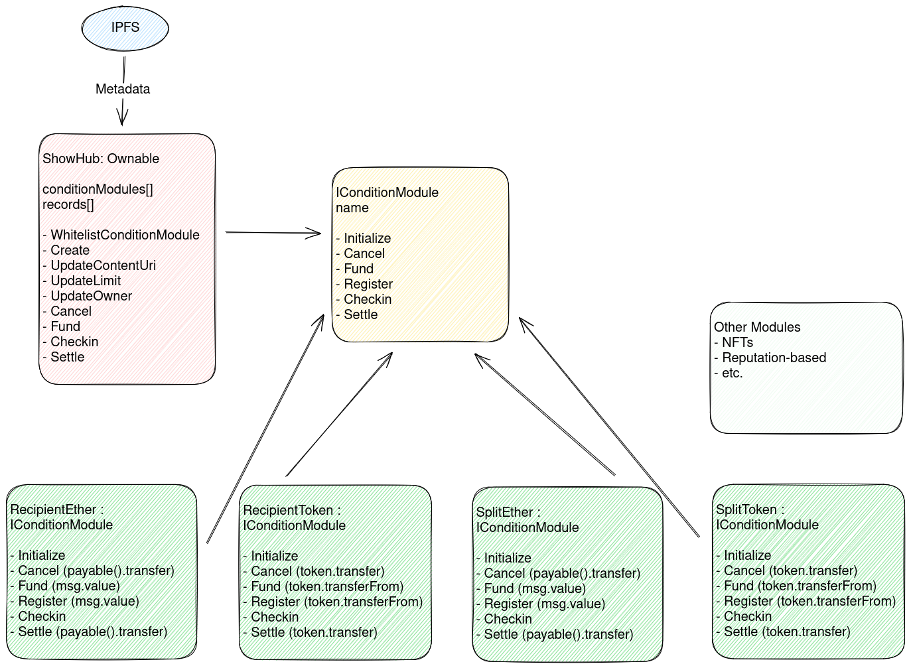

# Show Up Protocol

This package contains a set of smart contracts built on [Ethereum](https://ethereum.org/) using [Hardhat](https://hardhat.org/docs).

These contracts make up the Show Up Protocol that help manage commitments and the conditions for keeping them. It is designed and built in combination with the [Show Up App](../app), which focuses specifically on RSVP and Events management. The protocol however is designed to be generic and can used by other clients or front-ends that facilitate other use cases. E.g. habit tracking, health or fitness challenges, tracking progress on bootcamps or courses, etc.

## Contracts



**Core**

The protocol is made up of the following core contracts:

- [Registry](./contracts/Registry.sol) - this is the main contract and entry point that manages the records of commitments and forwards the calls to a required condition module.
- [Common](./contracts/Common.sol) - a library for common structs, types and errors.

**Condition Modules**

Condition modules manage the logic for keeping commitments and distributing rewards. Any record in the Registry must use a required condition module. Condition modules should implement the [IConditionModule](./contracts/interfaces/IConditionModule.sol) interface. The Registry can whitelist or disable condition modules. This allows for other use-cases to be built. E.g. reputation based modules, or modules that use other tokens, assets or fund public goods.

The following condition modules are available:

- [BasicEther](./contracts/conditions/BasicEther.sol) - a condition module that allows deposits and distribution of funds using Ether as native currency
- [BasicToken](./contracts/conditions/BasicToken.sol) - a condition module that allows deposits and distribution of funds using any ERC20 tokens
- [AbstractBasicModule](./contracts/conditions/AbstractBasicModule.sol) - a base contract for the BasicEther and BasicToken modules. It defines the interface and implements the shared functionality that between both modules.

Condition modules could be used independently (although it's not specifically designed that way and untested).

**Mocks**

The [Token](./contracts/mocks/Token.sol) contract is only used for mock and testing purposes of the `BasicToken` module. It is not a necessary contract or component of the protocol.

### Business logic and structure

#### Actors

- **Owner** - the owner of the registry contract. The owner can whitelist or disable condition modules. It has no other privileges or admin controls.
- **Record Owner** - the creator of a record (e.g. event organizer). This is the person that defines the conditions for registration, deposits and distribution.
- **Participant** - a person who commits to a record (e.g. RSVP to an event).
- **Attendee** - a participant who've been marked as attended by the event organizer.

#### Functions

- **Create** - anyone can create a new record that includes a hash as contentUri for metadata and the condition module to use for that record. The person who creates the record will be the **Record Owner**.
  - Metadata is defined using standardized formats to allow for App-specific indexing. Metadata can be stored anywhere offchain (e.g. IPFS) and uses a similar approach to tokenUris in NFTs. It currently supports Event Metadata. See [Event Metadata](../app/src/utils/types.ts) for more details.
  - A condition module should be whitelisted and implement the [IConditionModule](./contracts/interfaces/IConditionModule.sol) interface.
- **Cancel** - the **Record Owner** can cancel a record at any time. When an event is cancelled it returns all previous deposits to the participants.
  - `BasicEther` and `BasicToken` add additional checks that an event must not have taken place yet and no participants have been checked in yet.
- **Register** - anyone can register themselves or another account by depositing the required amount as defined by the record's condition module. Registering someone else means sponsoring the deposit fee. Only the person for who is paid for becomes a **Participant**. The deposit is held in the respective condition module contract until the record is cancelled or settled.
  - `BasicEther` uses Ether as native currency and the `msg.value` of the payable register function
  - `BasicToken` requires an ERC20 token approval from the participant to the condition module contract before calling the register function
- **Checkin** - the **Record Owner** can checkin any number of participants. Participants must've registered themselves before. Keeping track of check-ins is a manual process that can be done offchain.
- **Settle** - the **Record Owner** can settle a record after it has ended. The registry contract divides the pot of all **Participants** distributes it equally between all **Attendees**. Distribution is defined by the condition module.
  - `BasicEther` uses Ether as native currency and uses payable transfer to distribute funds
  - `BasicToken` uses ERC20 token transfers to distribute funds

#### Calldata

All the functions of the registry contract use calldata to pass arguments to the condition module. This allows for more flexibility and extensibility to design and build new condition module without any restrictions of what should be included. The registry contract does not validate the calldata. The condition module is responsible to handle and validate the calldata.

## Deployed Contracts

### Sepolia

- Registry [0x0959f7dD732631B7600fcCe67312920d4F5ECB9c](https://sepolia.etherscan.io/address/0x0959f7dD732631B7600fcCe67312920d4F5ECB9c)
- BasicEther [0x0b6b25a06A2EE6c560BB33EbDbECA831f2D67836](https://sepolia.etherscan.io/address/0x0b6b25a06A2EE6c560BB33EbDbECA831f2D67836)
- BasicToken [0x11FB53694e42972925940836a1E3EC71cA584936](https://sepolia.etherscan.io/address/0x11FB53694e42972925940836a1E3EC71cA584936)
- Token (test token) [0x7ef7024B76791BD1f31Ac482724c76f0e24a2dD0](https://sepolia.etherscan.io/address/0x7ef7024B76791BD1f31Ac482724c76f0e24a2dD0)

## Development

Try running some of the following tasks:

```
yarn build
yarn deploy
yarn test
yarn coverage
```

## Deploy

Once you're ready to deploy your contracts, setup a deployer account using `DEPLOYER_KEY` and try to run e.g.

```
yarn deploy --network sepolia
```

Note that you need testnet Ethers for that. More info and faucet links can be found on [Sepolia Dev](https://sepolia.dev/). You can set up different networks using [Hardhat's network configuration](https://hardhat.org/hardhat-runner/docs/config#networks-configuration).

## Verify

Contracts are automatically verified on Etherscan if you've set up the `ETHERSCAN_API_KEY` environment variable. You can also verify contracts manually using

```
yarn verify
```

## Wagmi CLI

The front-end uses the [Wagmi CLI](https://wagmi.sh/cli/getting-started) to automatically generate types and default hooks for your contracts. You can find the generated files in `src/abi.test`.

```
yarn wagmi
```
